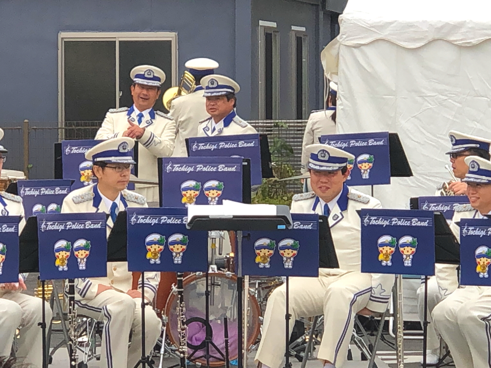
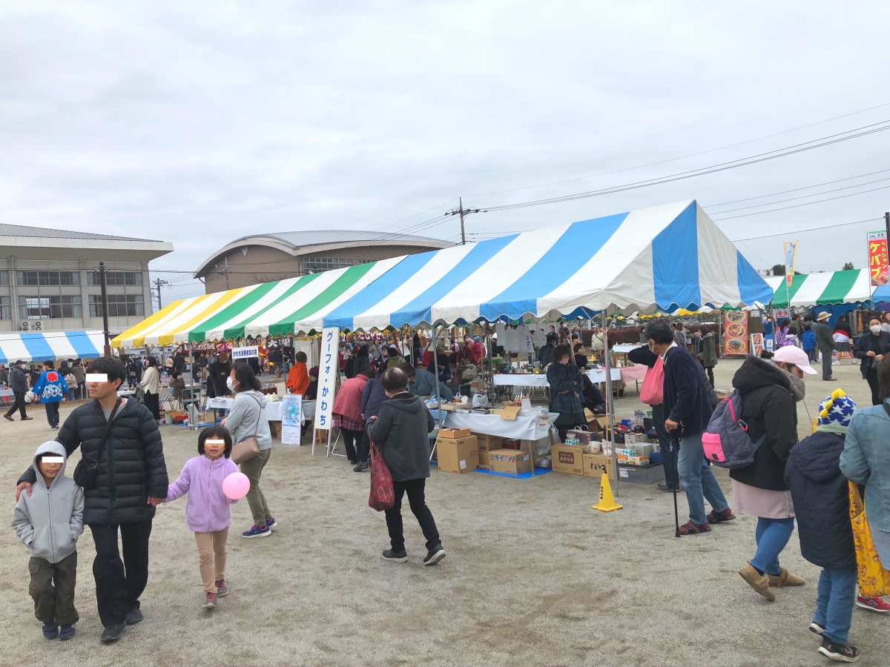
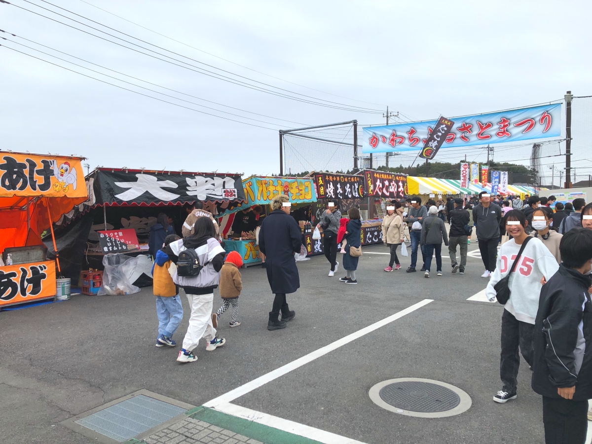
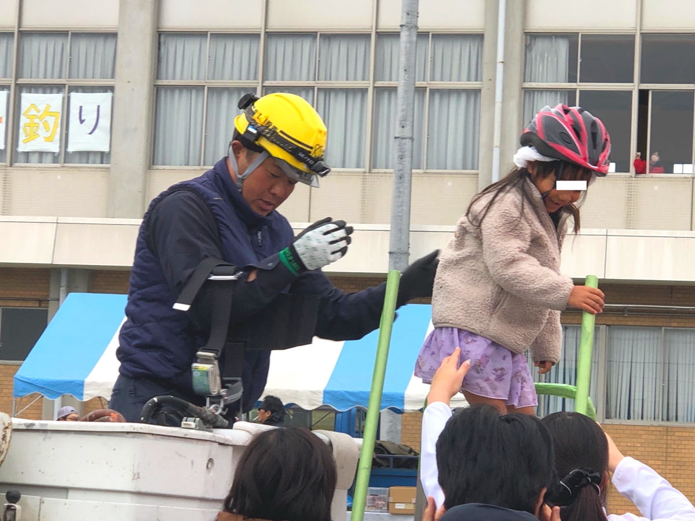

# 20231112_かわち、ふるさとまつり

<html>
<head>

<meta charset="UTF-8">
<meta http-equiv="Content-Type" content="text/html; charset=UTF-8">
<meta http-equiv="X-UA-Compatible" content="IE=EmulateIE10" />
<meta http-equiv="X-UA-Compatible" content="IE=edge">

<!--ここから上はお決まりの定型文です-->

<!--ここからが表現の書式などを決めるcssという部分-->

<link href="https://cdnjs.cloudflare.com/ajax/libs/lightbox2/2.7.1/css/lightbox.css" rel="stylesheet">

</head>

<body>

モバイル端末をお使いの場合は、画面を横向きにすると
より見やすくご覧頂けます。

<!--ここ上は、ほぼそのまま使います！-->

<!--QRコードの挿入例-->

 アクセス用QRコード

<marquee direction="left" scrollamount="20" width="30%">(^_^)/~hada</marquee>

<!--流れ文字の挿入例-->
<h1><marquee behavior="alternate">!!! かわちふるさとまつり 2023/11/12 @かわち自治センター !!!</marquee></h1>

<!--ここから下が、本体部分-->
 
寒空の下、かわちふるさとまつりに来てみました。

  
以下会場で撮った映像！

EV体験試乗

音楽隊のお姉さんは寒そうです

溶接体験

子供達が足場体験

女の子はパトカーに座ってニッコリ

栃木県警音楽隊の生演奏

<iframe width="560" height="315" src="https://www.youtube.com/embed/CAZRveAAuLM?si=f2qzVjnJLvNVdbvw" title="YouTube video player" frameborder="0" allow="accelerometer; autoplay; clipboard-write; encrypted-media; gyroscope; picture-in-picture; web-share" allowfullscreen></iframe>

小学生の男の子が溶接体験

<iframe width="560" height="315" src="https://www.youtube.com/embed/TcCewtGYHAg?si=KuR0ZI45oz-cMw5Z" title="YouTube video player" frameborder="0" allow="accelerometer; autoplay; clipboard-write; encrypted-media; gyroscope; picture-in-picture; web-share" allowfullscreen></iframe>
      

たまちゃんがおことこの子達と来てましたね〜モテモテ〜(^_^)v

<!--本体はここまで-->

<!--画面に空白地帯を作って、背景が見えるようにしています-->
                                              

<!-- フッタ -->
<footer>
Copyright 2023/11/12 S.Hada
</footer>

<!--HPにさまざまなJavaScriptを呼び込むための書式-->

</body>

</html>
